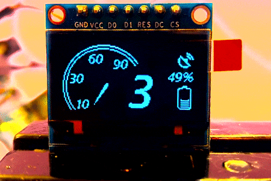

# Oled Speed display

This projects implements a graphical speedometer on a SSD1306 0.96" Oled screen.




## Starting the project

- UpLoad the files `oled_speed.py` and `images.bin` to the ESP8266
- Copy the content of the file `OledSpeed_SPIKE.py` to a new project in the Lego Education SPIKE Prime IDE
- check correct ports for Moror and ESP8266 module
- start project on the SPIKE prime

## Background

There are some good introductions on how to convert images to fir on the small 128x64 pixel Oled screen:
- (https://youtu.be/H174EUG2kL0)
- [Online image to bytearray converter](http://javl.github.io/image2cpp/)

The images used in this projects come from [this tutorial](https://electropeak.com/learn/the-beginners-guide-to-display-text-image-animation-on-oled-display-by-arduino/). The C-style images were converted to python and are written consequently in a binary file with each image of 1024 bytes. Code for writing the binary file can be found here: (./CreateImages/write_images.py)

The code below shows how the images are displayd on de Oled screen. By using `seek` we skip to the correct image. The image is read in a temporary `bytearray f`. From that array a `FrameBuffer` object is generated, which is displayed on the screen by the `blit` method.

```python
f=open('images.bin','rb') # open binary file containing 17 images of 1024 bytes each for speeds as in array speeds
i=10 # 10th image in file
f.seek(i*1024) # skip to the ith image
d=bytearray(f.read(1024)) # read image
fbuf=framebuf.FrameBuffer(d, 128, 64, framebuf.MONO_HLSB) # fill framebuffer with image
oled.blit(fbuf,0,0) # blit framebuffer to posision 0,0
oled.show()  # show current screen
```
